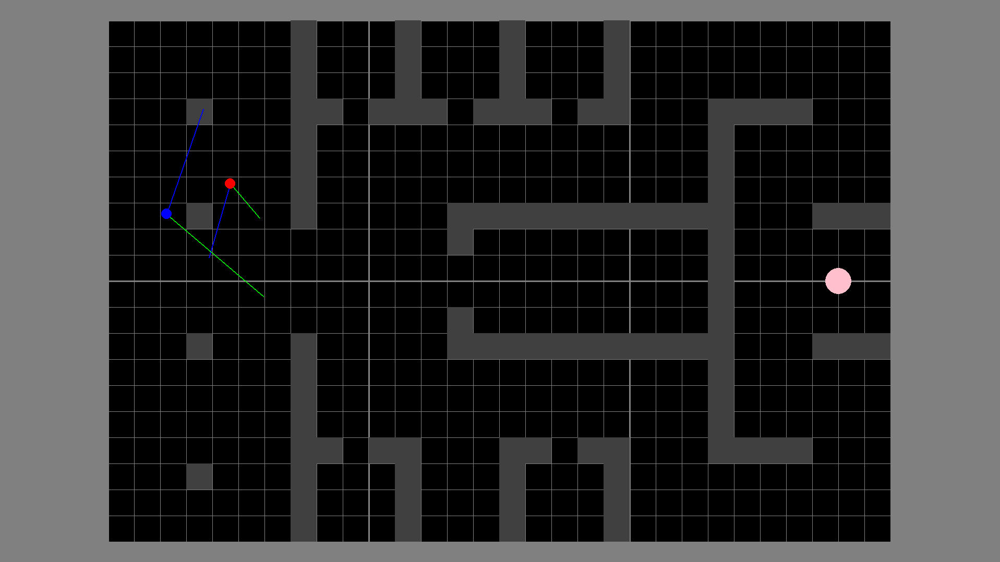
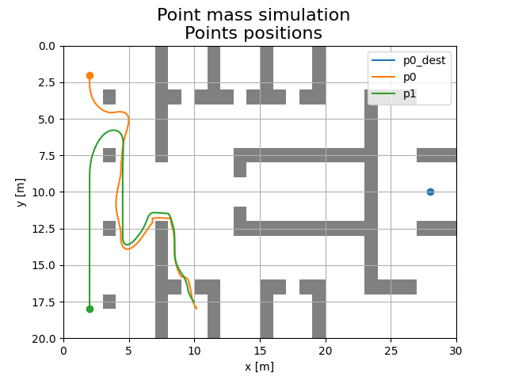

# Model pościgowy
## Projekt z przedmiotu "Studio projektowe 1"

# Autorzy

- [Łukasz Łabuz](https://github.com/luklabuz)
- [Tomasz Kawiak](https://github.com/hevagog)
- [Mateusz Mazur](https://github.com/mzsuetam)

# Temat projektu

Tematem projektu jest stworzenie modelu pościgowego,
który będzie pozwalał na symulację zachowań 1 policjanta (goniący) i 1 przestępcy (uciekający)
w zamkniętej przestrzeni.

## Założenia projektowe

- Przestrzeń będzie zawierała przeszkody oraz będzie ładowana z pliku.
- Aktorzy będą w stanie poruszać się oraz reagować na obecność przeszkód i innych aktorów.
- Uciekający będzie szukał wyjścia z przestrzeni (docelowego punktu).
- Goniący będzie próbował złapać (dotknąć) uciekającego.
- Po zakończeniu symulacji będzie możliwa analiza danych dotyczących symulacji.

# Rozwiązanie problemu

## Środowisko symulacyjne

Symulacja została zrealizowana w języku Python, z wykorzystaniem bibliotek PyGame oraz NumPy.

Symulator został zrealizowany jako posty, dyskretny silnik fizyczny,
który symuluje ruch aktorów w przestrzeni, jako ruch punktów materialnych.
Oddziaływanie na ruch aktorów jest realizowane
poprzez zastosowanie sił, które są nakładane na punkty materialne.

Wyświetlanie przestrzeni oraz aktorów jest realizowane poprzez bibliotekę PyGame 
na podstawie stanu symulacji.
GUI symulatora przedstawione jest na rysunku \ref{img:hui}

{width=80%}

Po zakończeniu symulacji możliwy jest eksport danych dotyczących symulowanych punktów.
Istnieje również możliwość wyświetlenia wykresów z danymi dotyczącymi symulacji
(stworzonymi na podstawie eksportowanych danych).
Przykładowy wykres pozycji aktorów
przedstawiony jest na rysunku \ref{img:chart}.

{width=60%}

## Model zachowań aktorów

Zachowanie aktorów realizowane jest poprzez kontrolery.
W każdym kroku czasowym symulatora, kontrolery aktorów decydują o tym, jakie siły mają zostać nałożone na aktorów.
Modelują one jednocześnie stan wiedzy aktorów, podejmowane przez nich decyzje oraz ich zachowania.

Kontrolery aktorów są zaimplementowane w taki sposób, aby były niezależne od siebie.
Dzięki temu można je dowolnie łączyć, aby uzyskać pożądane zachowanie aktora.
Na potrzeby symulacji zostały zaimplementowane m.in. następujące kontrolery:

- `astar`: kontroler, który realizuje poruszanie się w przestrzeni na bazie wyjścia z algorytmu A*,
- `forecasting`: kontroler, który realizuje przewidywanie ruchu danego aktora
- `vision`: kontroler, który realizuje poszukiwanie celu oraz ograniczenie widoczności aktora
- `escaping`: kontroler realizujący ucieczkę aktora, korzysta z kontrolera `astar` oraz `vision`, 
  dokładając do nich chęć ucieczki od aktora, który go goni.
- `chasing`: kontroler realizujący gonienie aktora, korzysta z kontrolera `astar` oraz `forecasting`, 
  rozszerzając jego funkcjonalność o chęć dotknięcia uciekającego aktora.
  Wykorzystaliśmy w tym przypadku macierz prawdopodobieństwa przyszłej pozycji aktora uciekającego.

# Napotkane trudności i ich rozwiązania

## Przewidywanie przez aktora goniącego pozycji aktora uciekającego

Rozwiązaniem tego problemu było zastosowanie macierzy prawdopodobieństwa przyszłej pozycji aktora uciekającego.
Macierz ta jest obliczana na podstawie prędkości poruszania się uciekającego przez kontroler `forecasting` 
z późniejszym uwzględnieniem przeszkód w przestrzeni. Inspiracją do tego rozwiązania był projekt 4: _Ghostbusters_
z kursu [UC Berkeley CS188 Intro to AI](http://ai.berkeley.edu/tracking.html).

## Wykorzystanie kontrolerów w innych kontrolerach

Pierwszym pomysłem implementacji kontrolerów było wykorzystanie dziedziczenia.
Pojawił się jednak problem, że kontrolery nie mogły być ze sobą łączone,
ponieważ ich metoda `update` była nadpisywana, a nie rozszerzana.
Wadą takiego rozwiązania jest np. aktywacji tylko w pewnych przypadkach
lub ograniczenia wartości sił zwracanych przez kontrolery.
Rozwiązaniem tego problemu było wykorzystanie kompozycji
oraz rozdzielenie logiki kontrolerów od faktycznego wpływu na aktora.

## Optymalizacja działania kontrolerów

Aby zmniejszyć czasy obliczeń, zastosowaliśmy m.in. następujące optymalizacje:

- wykorzystanie macierzy NumPy do obliczeń zamiast pętli,
- zmniejszenie częstości próbkowań otoczenia aktora, 
- wprowadzenie listy visited nodes, aby uniknąć wielokrotnego odwiedzania tego samego węzła w grafie.

W przypadku przewidywania pozycji aktora uciekającego przez aktora goniącego
czas wykonywania obliczeń udało się nam zmniejszyć około 100-krotnie.

# Podział prac

- Łukasz Łabuz
  - stworzenie kontrolera przewidywania
  - stworzenie kontrolera gonienia
- Tomasz Kawiak
  - stworzenie kontrolera widzenia
  - stworzenie kontrolera ucieczki
- Mateusz Mazur
  - stworzenie silnika symulacyjnego
  - optymalizacja działania kontrolerów gonienia i ucieczki
